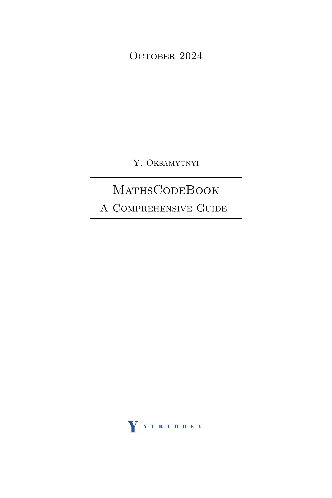
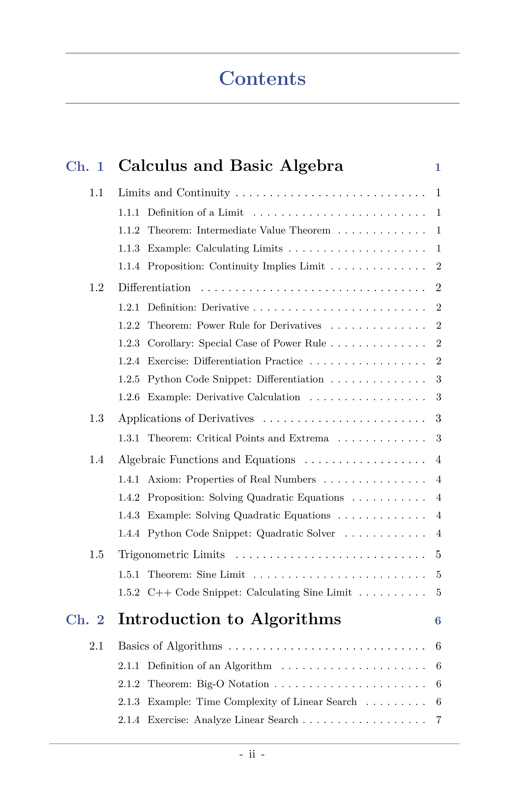
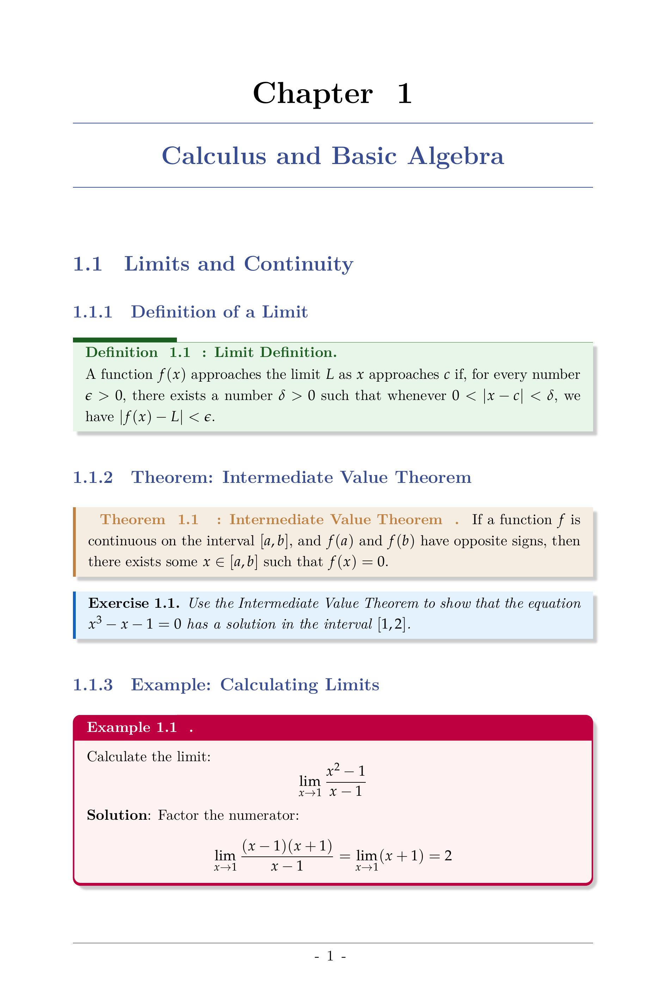
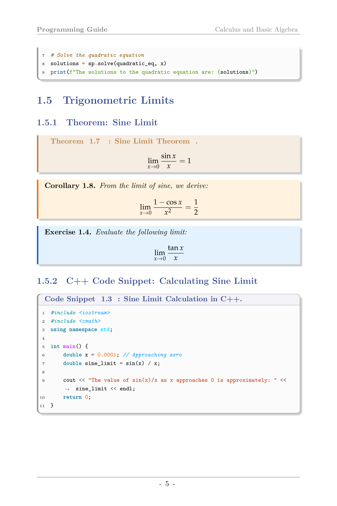
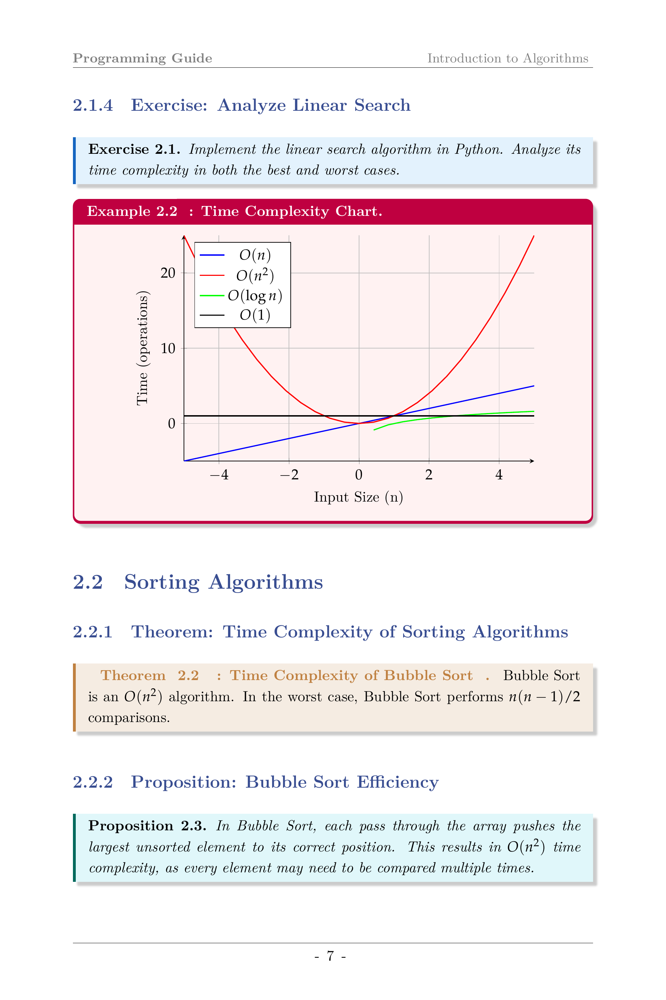
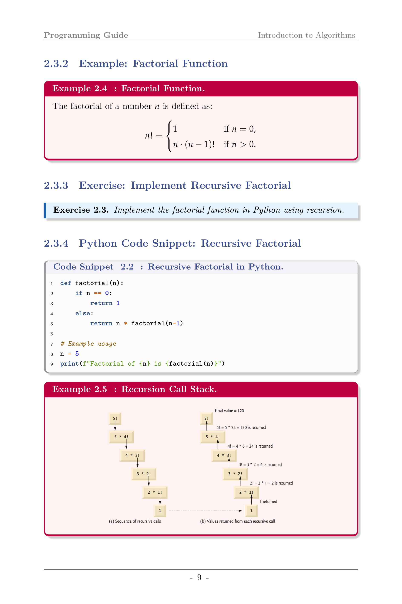

# 📚 MathsCodeBook 


MathsCodeBook is a comprehensive LaTeX template designed to generate high-quality math books with custom environments, code snippets, and advanced formatting. 📘


## 🔧 Key Features

- **Custom Environments**: Predefined environments for theorems, corollaries, lemmas, propositions, exercises, and more, with distinct color-coded boxes using `tcolorbox`.
- **Syntax Highlighting**: Built-in support for Python and C++ code snippets with syntax highlighting using `minted`.
- **Advanced Typography**: Fully customizable font and layout settings (supports Montserrat, MathPazo, etc.) with headers, footers, and section titles styling.
- **Integrated Charts and Diagrams**: Seamlessly embed TikZ, PGFPlots, and standalone graphics for charts, call stacks, and more.
- **Professional Title Pages**: Customizable title and table of contents pages to match the style of the book.
- **Compatibility**: Can be compiled using XeLaTeX and pdfLaTeX.
- **Compiles with**: `pdfLaTeX`, `XeLaTeX`, and `LuaLaTeX`.


## 🌟 Example Content Previews

| **Title Page**                                     | **Table of Contents**                                |
|----------------------------------------------------|-----------------------------------------------------|
| A beautifully designed title page with custom title, author name, and logos. | Auto-generated, customizable table of contents.     |
|  |  |

| **Chapter 1 Opening**                              | **Python & C++ Code Snippets**                       |
|----------------------------------------------------|-----------------------------------------------------|
| Elegant chapter opening with theorems and formatting. | Syntax-highlighted Python and C++ code snippets.     |
|  |  |

| **Time Complexity Chart**                          | **Recursion Call Stack**                             |
|----------------------------------------------------|-----------------------------------------------------|
| Visually clear time complexity chart.              | Recursion call stack visualization using LaTeX.      |
|  |  |


## 🚀 Quick Start

1. **Clone the repository**:
   ```bash
   git clone https://github.com/YurioDev/MathsCodeBook.git
   ```
2. **Compile the template**: 
   - Using **XeLaTeX** or **pdfLaTeX**.
   - Make sure you have `minted` and `tcolorbox` packages installed.
3. **Customize your content**:
   - Add your own chapters in the `Chapters/` folder.
   - Modify the `main.tex` and `styles.cls` files for additional customization.


## 📂 Directory Structure

```
.
├── Chapters
│   ├── ch01
│   │   ├── chapter01.tex
│   │   ├── quadratic_solver.py
│   │   ├── sine_limit.cpp
│   │   └── snippet_python.py
│   ├── ch02
│   │   ├── big_o_graph.tex
│   │   ├── bubble_sort.py
│   │   ├── chapter02.tex
│   │   ├── recursion_stack.tex
│   └── ch03
│       ├── chapter03.tex
│       └── eigenvalues.py
├── Example_pages
│   └── MathsCodeBook_Extracted_Title_Page.pdf
├── MathsCodeBook_by_YurioDev.pdf
├── main.tex
└── styles.cls
```

## 💻 Supported Compilers

- **XeLaTeX** (Recommended for full feature support)
- **LuaLaTeX**
- **pdfLaTeX**

## 🔗 Useful Links

- **Overleaf Template**: [](https://www.overleaf.com/read/pykgwvdtnppf#ca6ce3)
- **Report an Issue**: [Report here](https://github.com/YurioDev/MathsCodeBook/issues)

### 🌟 Latest Version: 1.0

Released: **September 2024**

- Improved theorem formatting
- Added custom syntax highlighting for Python and C++
- Optimized tcolorbox usage for better customization

## 🚧 Upcoming Features

- **In-depth User Guide**: A full guide to setting up and customizing your documents.
- **Template Customization**: More detailed descriptions on how to alter environments, typography, and add/remove features.
- **Advanced TikZ Diagrams**: In-depth tutorials on creating complex diagrams and charts.
- **LaTeX Package Explanations**: Walkthroughs of the packages used and their configurations.
- **Additional Code Snippets**: More languages with syntax highlighting support.
- **CI/CD Integration**: Automated testing and deployment for LaTeX documents.

## 📜 License

Distributed under the CC0 License. See `LICENSE` for more information.

## 💡 Acknowledgements

Inspired by the [Alephsub0 Project](https://www.alephsub0.org/) and their amazing LaTeX book template. @alephsub0

## 🎉 Contributors

- **Yurii Oksamytnyi** (YurioDev) - Author and Developer

[![LinkedIn][linkedin-shield]](https://www.linkedin.com/in/y-oks)

[linkedin-shield]: https://img.shields.io/badge/linkedin-%230077B5.svg?style=for-the-badge&logo=linkedin&logoColor=white

### 📞 Contact Me

[](mailto:contact@yuriodev.co.uk)


Feel free to contribute by submitting a pull request! 😊

